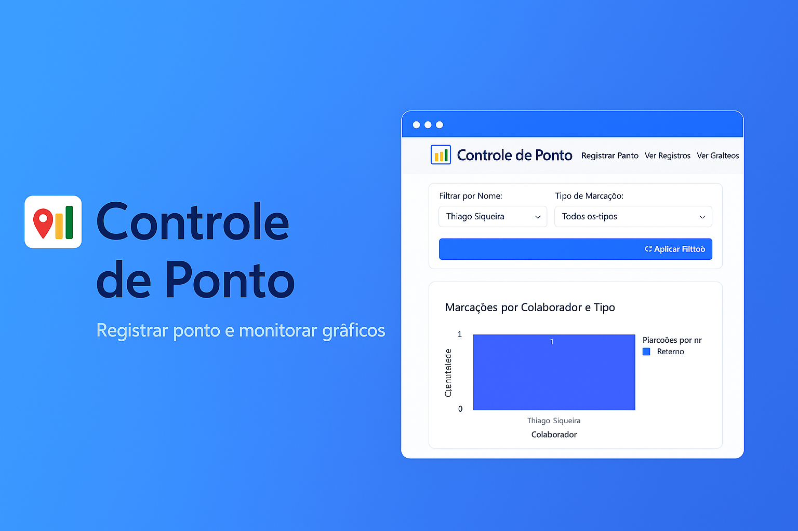

# 📍 Controle de Ponto Flask

Sistema de controle de ponto com geolocalização, autenticação de funcionários, gráficos interativos e exportações em CSV.


## 🚀 Funcionalidades

- ✅ Registro de ponto com autenticação por senha
- ✅ Geolocalização automática no momento do registro
- ✅ Gráficos interativos com Plotly
- ✅ Exportação de dados em CSV
- ✅ Cadastro e exclusão de funcionários
- ✅ Reset de senha com validação por data de nascimento e localização
- ✅ Interface responsiva com Bootstrap 5

## 🖥️ Tecnologias

- Python 3.10+
- Flask
- SQLite
- Plotly
- Bootstrap 5

## 📦 Instalação

1. Clone o projeto:

```bash
git clone https://github.com/ThiagoLuzpY/controle-ponto-flask.git
cd controle-ponto-flask


2. Crie um ambiente virtual:

python -m venv venv
source venv/bin/activate  # ou venv\Scripts\activate no Windows


3. Instale as dependências:

pip install -r requirements.txt


4. Execute a aplicação:

python app.py


🗂️ Estrutura

controle-ponto-flask/
│
├── templates/            # HTMLs com Bootstrap
├── static/               # Gráficos, arquivos e assets
├── app.py                # Lógica principal da aplicação
├── loja.db               # Banco de dados SQLite (gerado após rodar)
├── requirements.txt      # Dependências do projeto
├── README.md             # Este arquivo


📸 Prints
Em breve...


🛡️ Licença
Este projeto está sob a licença MIT.

