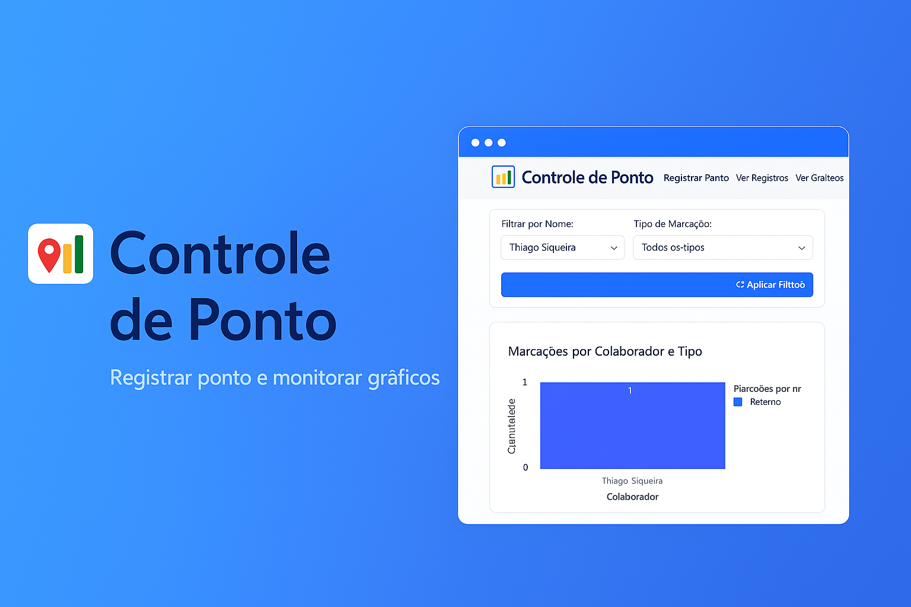

# 📍 Controle de Ponto Flask com Geolocalização e Rastreamento em Tempo Real

Sistema robusto de **controle de ponto** com **geolocalização automática**, **rastreamento em tempo real**, **status online/offline**, autenticação de funcionários, **gráficos interativos**, e exportações em **CSV**.


---

## 🚀 **Funcionalidades**

- ✅ **Registro de ponto** com autenticação por senha
- ✅ **Geolocalização automática** via navegador
- ✅ **Rastreamento em tempo real** com status **online/offline**
- ✅ **Gráficos interativos** com **Plotly**
- ✅ **Exportação de dados** em **CSV**
- ✅ **Cadastro, exclusão e reset de senha** de funcionários
- ✅ **Logs** de operações críticas
- ✅ **Interface responsiva** com **Bootstrap 5**
- ✅ **Mapa interativo** com **Leaflet.js** e **OpenStreetMap**
- ✅ Implementação de **PWA** com **service worker** (opcional evolução para APK)

---

## 🖥️ **Tecnologias Utilizadas**

- **Python 3.10+**
- **Flask** + **Flask-SocketIO**
- **SQLite**
- **Plotly**
- **Bootstrap 5**
- **Leaflet.js**
- **JavaScript**
- **Pandas**
- **Service Worker (PWA)**

---

## 📦 **Instalação**

1. Clone o projeto:  

```bash
git clone https://github.com/ThiagoLuzpY/flask_gps_ponto_online.git
cd flask_gps_ponto_online


2. Crie um ambiente virtual:

python -m venv venv
source venv/bin/activate  # ou venv\Scripts\activate no Windows


3. Instale as dependências:

pip install -r requirements.txt


4. Execute a aplicação:

python app.py


Acesse no navegador:
http://localhost:5000


🗂️ Estrutura Completa do Projeto

flask_gps_ponto_online/
│
├── build/                               # Build do PWA
│
├── static/                              # Arquivos estáticos
│   ├── icons/
│   │   ├── grafico_interativo.html
│   │   └── grafico_presenca.png
│   ├── manifest.json                    # Manifesto do PWA
│   ├── rastreamento.js                  # Lógica JS rastreamento
│   ├── rastreamento_tempo_real.js       # Lógica JS tempo real
│   ├── script.js                        # Script global
│   └── service-worker.js                # Service Worker PWA
│
├── templates/                           # Templates HTML com Bootstrap
│   ├── cadastro.html
│   ├── config_admin.html
│   ├── funcionarios.html
│   ├── graficos.html
│   ├── index.html
│   ├── login_admin.html
│   ├── login_funcionario.html
│   ├── logs.html
│   ├── rastreamento.html
│   ├── rastreamento_tempo_real.html
│   ├── registros.html
│   ├── reset_senha.html
│   └── selecao_perfil.html
│
├── app.py                               # Lógica principal da aplicação Flask
├── app.spec                             # Configuração de build (PyInstaller ou PWA)
├── banner.png                           # Banner do projeto
├── loja.db                              # Banco de dados SQLite (gerado após rodar)
├── README.md                            # Este arquivo
├── requirements.txt                     # Dependências do projeto
└── .gitignore                           # Arquivos ignorados pelo Git


🌍 Hospedagem atual
✅ Sistema hospedado em PythonAnywhere:
https://thiagoluz.pythonanywhere.com

📈 Possíveis evoluções
➡️ Transformar PWA em APK híbrido via Capacitor ou Flutter

➡️ Migrar backend para Supabase ou Firebase para maior escalabilidade

➡️ Implementar autenticação por tokens JWT

➡️ Adicionar notificações push via Web Push ou Firebase Cloud Messaging

📸 Prints


Adicione outras imagens na pasta prints/.

🛡️ Licença
Este projeto está sob a licença MIT.
Desenvolvido por Thiago Luz — 2025.

👾 Links úteis
✅ Repositório: github.com/ThiagoLuzpY/flask_gps_ponto_online

✅ Deploy: thiagoluz.pythonanywhere.com


⚠️ Observações importantes sobre execução
O projeto foi desenvolvido e está hospedado no PythonAnywhere, com banco de dados SQLite armazenado no próprio servidor, localizado neste caminho:

✅ ➡️ Para rodar no PythonAnywhere:
1. Criar uma conta gratuita em:
https://www.pythonanywhere.com/

2. Criar um "Web app" no painel e configurar:
Escolha Flask como framework

Configure o caminho para o arquivo app.py

Configure o "Working directory" como:
/home/ThiagoLuz/flask_gps_ponto_online  

3. Subir os arquivos via:
Upload direto na interface web

Ou via Git: git clone https:
//github.com/ThiagoLuzpY/flask_gps_ponto_online.git

4. Acessar o "Bash Console" e instalar as dependências:
pip3 install --user -r requirements.txt
✅ Obs: no PythonAnywhere, use pip3 install --user sempre!

5. Ajustar o DB_PATH se usar outro diretório.
O SQLite será automaticamente criado pelo app.py se não existir.
✅ A função criar_tabelas() já cuida disso.


✅ ➡️ Para rodar localmente:
1. No app.py, altere o DB_PATH para um caminho local:
DB_PATH = "loja.db"

2. Após rodar o app.py pela primeira vez, o arquivo loja.db será criado automaticamente no diretório do projeto.

3. O restante da execução permanece igual:

python app.py

Acesse:
http://localhost:5000

✅ Dicas importantes:
Cenário	Configuração recomendada
✅ Hospedando no PythonAnywhere	Mantenha o caminho absoluto em DB_PATH
✅ Rodando localmente	Ajuste para caminho relativo
✅ Rodando em outro servidor Linux	Configure o DB_PATH de acordo com a pasta onde colocará o loja.db
✅ Migrando para outro banco (PostgreSQL, MySQL)	Ajuste a conexão e as queries no app.py

✅ Sobre o API Key do OpenCage:
Este projeto utiliza a API do OpenCage para conversão de latitude e longitude em endereços:
OPENCAGE_API_KEY = "c9aac9c2ac4b468fbd700c9dc1489763"


✅ Lembre-se:

Pode manter a key pública para testes, mas para produção → use variáveis de ambiente ou .env.

No PythonAnywhere → configure variáveis no painel de "Environment Variables" e acesse via:

import os
OPENCAGE_API_KEY = os.getenv('OPENCAGE_API_KEY')

✅ Exemplo atualizado de inicialização no app.py:

import os

app = Flask(__name__, static_url_path='/static')
socketio = SocketIO(app, cors_allowed_origins="*")
app.secret_key = os.getenv("SECRET_KEY", "segredo_super_secreto_123")
DB_PATH = os.getenv("DB_PATH", "/home/ThiagoLuz/flask_gps_ponto_online/loja.db")
OPENCAGE_API_KEY = os.getenv("OPENCAGE_API_KEY", "c9aac9c2ac4b468fbd700c9dc1489763")

✅ Assim fica mais seguro e flexível para diferentes ambientes.


✅ Resumo:
Cenário	Ação
Rodar no PythonAnywhere	✅ Siga os passos acima, mantenha DB_PATH absoluto
Rodar localmente	✅ Altere DB_PATH para relativo
Melhorar segurança	✅ Use variáveis de ambiente para SECRET_KEY e OPENCAGE_API_KEY


